# Alumno 1 (ORACLE):

1.Crea un rol ROLPRACTICA con los privilegios (no roles) necesarios para conectarse a la base de datos, crear tablas y vistas e insertar datos en la tabla EMP de SCOTT.

```
CREATE ROLE ROLPRACTICA;

GRANT CONNECT, CREATE VIEW, CREATE TABLE TO ROLPRACTICA;

GRANT INSERT ON SCOTT.EMP TO ROLPRACTICA;
```


2.Crea un usuario USRPRACTICA con el tablespace USERS por defecto y averigua que cuota se le ha asignado por defecto en cada tablespace. Ponle una cuota de 1M en USERS.


```
CREATE USER USRPRACTICA IDENTIFIED BY "usuario" DEFAULT TABLESPACE USERS;

SELECT USERNAME,BYTES FROM DBA_TS_QUOTAS WHERE USERNAME = 'USRPRACTICA';

sqlplus  USRPRACTICA/usuario

```


```
Cambio la cuota y verificamos.

ALTER USER USRPRACTICA QUOTA 1M ON USERS;

SELECT USERNAME,BYTES FROM DBA_TS_QUOTAS WHERE USERNAME = 'USRPRACTICA';

```


3.Modifica el usuario USRPRACTICA para que tenga cuota 0 en el tablespace SYSTEM.

```
ALTER USER USRPRACTICA QUOTA 0 ON SYSTEM;
```


4.Concede a USRPRACTICA el ROLPRACTICA.

```
GRANT ROLPRACTICA TO USRPRACTICA;
```


5. Concede a USRPRACTICA el privilegio de crear tablas, insertar y modificar datos en el esquema de cualquier otro usuario. Prueba el privilegio. Comprueba si puede modificar la estructura o eliminar las tablas creadas.

```
GRANT CREATE ANY TABLE, INSERT ANY TABLE TO USRPRACTICA;
```

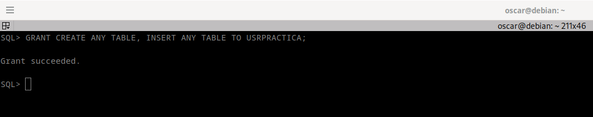


```
Crear tablas, insertar y modificar datos.

create table SCOTT.ejemplo1(
                nombre varchar2(15),
                apellido1 varchar2(15)
        );

INSERT INTO SCOTT.ejemplo1 VALUES ('Oscar','Sanabria');
INSERT INTO SCOTT.ejemplo1 VALUES ('Luis','Sanabria');

```
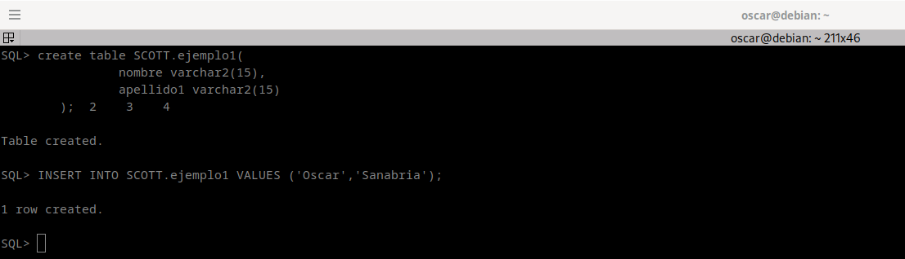


```
Otros privilegios

ALTER TABLE SCOTT.ejemplo1 DROP COLUMN apellido1;

delete from SCOTT.ejemplo1;

drop table SCOTT.ejemplo1;

```
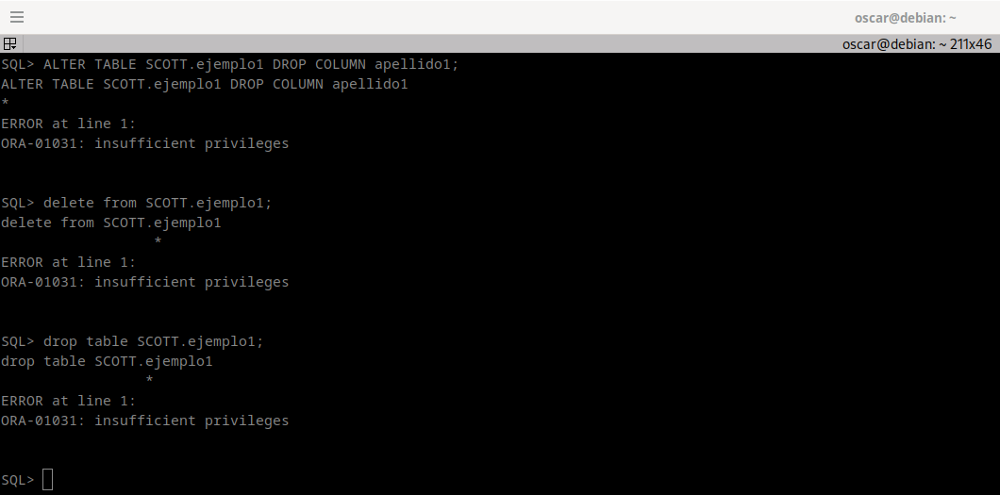


6. Concede a USRPRACTICA el privilegio de leer la tabla EMP de SCOTT con la posibilidad de que lo pase a su vez a terceros usuarios.

```
GRANT SELECT ON SCOTT.DEPT TO USRPRACTICA WITH GRANT OPTION;

select * from SCOTT.DEPT;
```

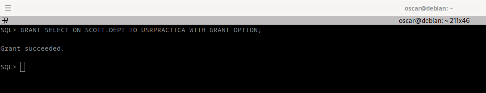
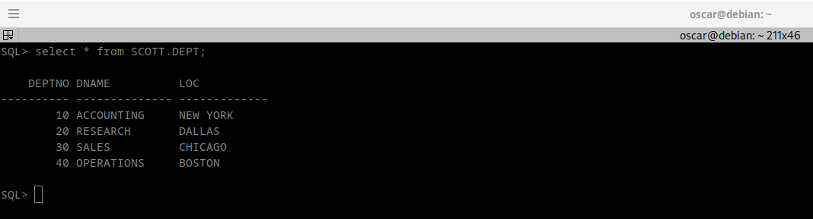


7. Da a USRPRACTICA los permisos necesarios para poder crear triggers sobre sus tablas.

```
GRANT CREATE TRIGGER TO USRPRACTICA;
```
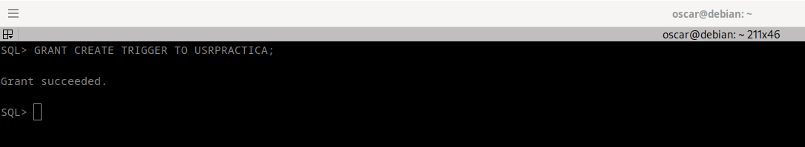

8. Quita a USRPRACTICA el privilegio de crear vistas. Comprueba que ya no puede hacerlo.

```
REVOKE CREATE VIEW FROM ROLPRACTICA;

create VIEW ejemplo AS select  *  from scott.emp;
```

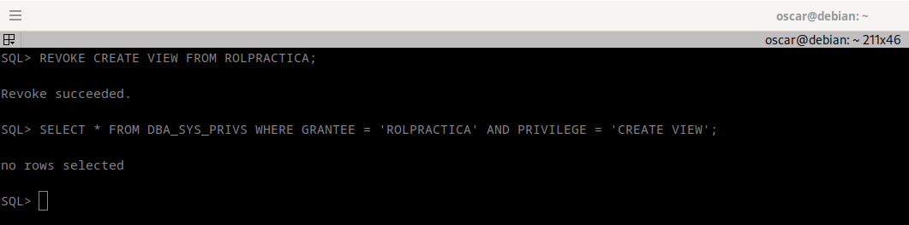
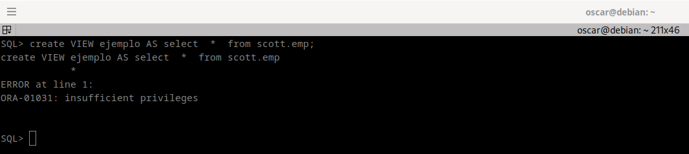


9. Crea un perfil ESCLAVO que limita a uno el número de minutos de inactividad permitidos en una sesión y a ocho minutos el tiempo máximo de duración de una sesión.

```
CREATE PROFILE ESCLAVO LIMIT IDLE_TIME 1 CONNECT_TIME 8;
```
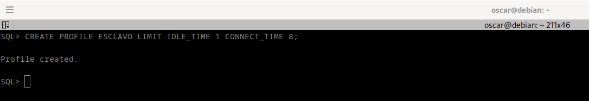


10. Activa el uso de perfiles en ORACLE. Modifica el perfil ESCLAVO poniendo el parámetro COMPOSITE LIMIT en su valor mínimo. Comprueba cuántas operaciones se pueden realizar.

```
ALTER PROFILE ESCLAVO LIMIT COMPOSITE_LIMIT DEFAULT;
```
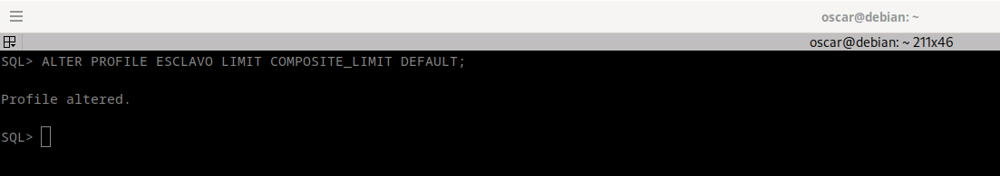

11. Asigna el perfil creado a USRPRACTICA y comprueba su correcto funcionamiento.

```
ALTER USER USRPRACTICA PROFILE ESCLAVO;
```

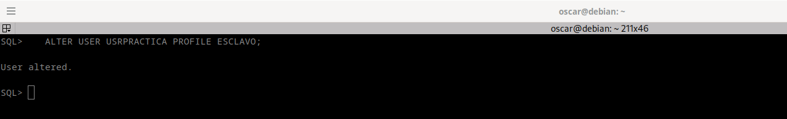


12. Crea un perfil CONTRASEÑASEGURA especificando que la contraseña caduca semanalmente y sólo se permiten dos intentos fallidos para acceder a la cuenta. En caso de superarse, la cuenta debe quedar bloqueada por un mes.

```
CREATE PROFILE CONTRASENASEGURA LIMIT PASSWORD_LIFE_TIME 7 FAILED_LOGIN_ATTEMPTS 2 PASSWORD_LOCK_TIME 30;
```
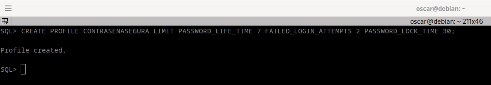

    • PASSWORD_LIFE_TIME: La contraseña caduca después de 7 días.
    • FAILED_LOGIN_ATTEMPTS: Se permiten 2 intentos fallidos para acceder a la cuenta.
    • PASSWORD_LOCK_TIME: La cuenta se bloqueará por 30 días en caso de superar los intentos fallidos.

13. Asigna el último perfil creado a USRPRACTICA y comprueba su funcionamiento. Desbloquea posteriormente al usuario.

```
ALTER USER USRPRACTICA PROFILE CONTRASENASEGURA;

```
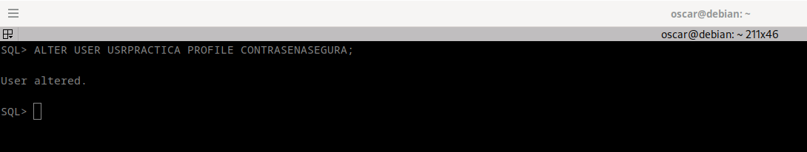

Conexión con el usuario:
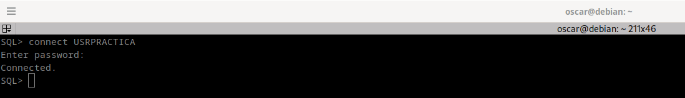

Bloquear cuenta: 
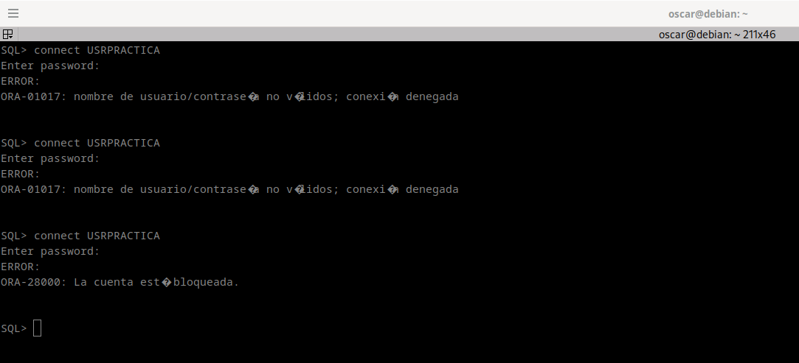

Desbloquear cuenta:
```
ALTER USER USRPRACTICA ACCOUNT UNLOCK;
```

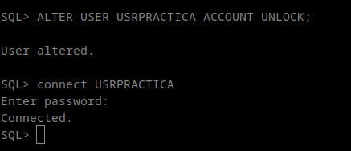


14. Elige un usuario concreto y consulta qué cuota tiene sobre cada uno de los tablespaces.

```
SELECT 
    USERNAME,
    TABLESPACE_NAME,
    SUM(BYTES) AS MEGABYTES
FROM 
    DBA_TS_QUOTAS
WHERE 
    USERNAME = 'SCOTT'
GROUP BY 
    USERNAME, TABLESPACE_NAME;

```
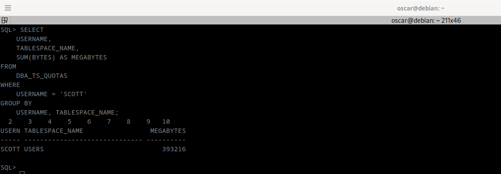

15. Consulta qué usuarios existen en tu base de datos con la cuota de algún tablespace gastada en más de un 50%.

```
SELECT USERNAME, TABLESPACE_NAME, BYTES, MAX_BYTES
FROM DBA_TS_QUOTAS
WHERE (BYTES / MAX_BYTES) > 0.5;

SELECT  * FROM DBA_TS_QUOTAS;
```


16. Elige un usuario concreto y muestra qué privilegios de sistema tiene asignados.

```
SELECT * FROM DBA_SYS_PRIVS WHERE GRANTEE = 'RAUL';
```

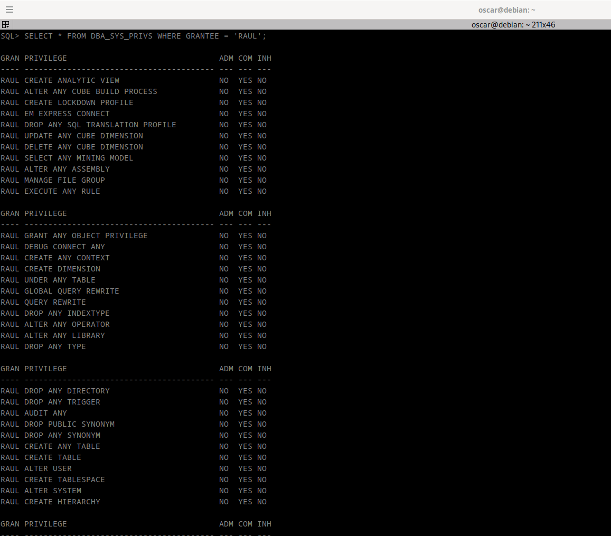

17. Elige un usuario concreto y muestra qué privilegios sobre objetos tiene asignados con la posibilidad de concederlos a otro usuario.

```
SELECT 
    GRANTEE,
    PRIVILEGE,
    TABLE_NAME,
    GRANTABLE
FROM 
    DBA_TAB_PRIVS
WHERE 
    GRANTEE = 'USRPRACTICA';
```
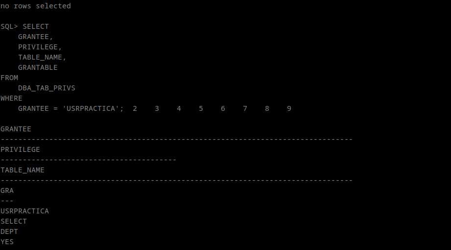


18. Consulta qué roles existen en tu base de datos.

```
SELECT ROLE FROM DBA_ROLES;
```
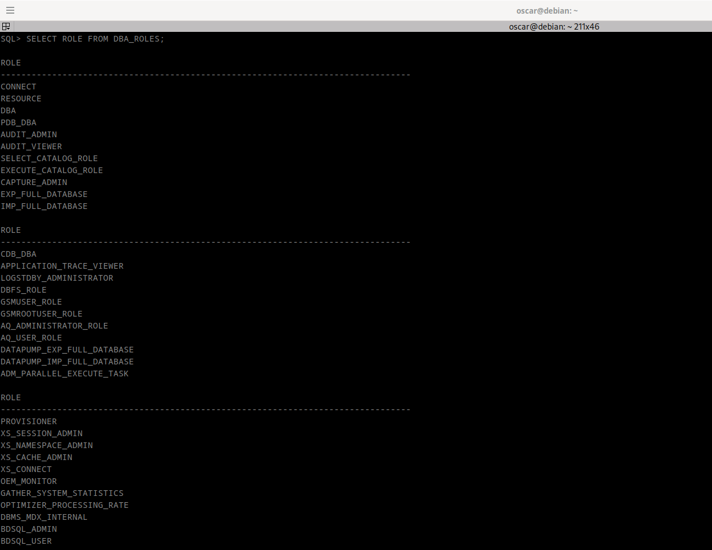

19. Elige un rol concreto y consulta qué usuarios lo tienen asignado.
```
SELECT GRANTEE FROM DBA_ROLE_PRIVS WHERE GRANTED_ROLE = 'RESOURCE';
```
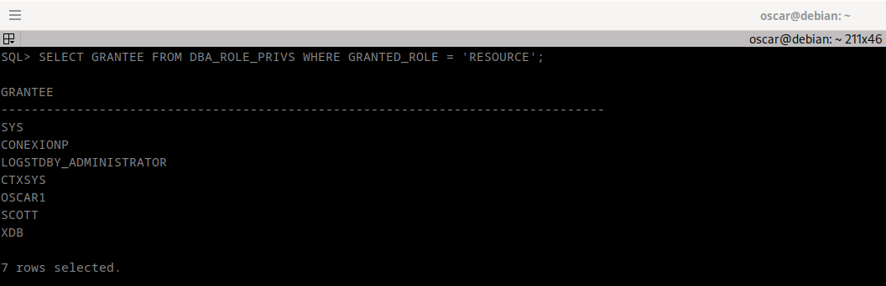

20. Elige un rol concreto y averigua si está compuesto por otros roles o no. La consulta debe responder SI o NO.

```
SELECT granted_role FROM dba_role_privs WHERE grantee = 'RESOURCE';

SELECT 
    CASE 
        WHEN COUNT(*) > 0 THEN 'SI'
        ELSE 'NO'
    END AS TIENE_OTROS_ROLES
FROM 
    DBA_ROLE_PRIVS
WHERE 
    GRANTEE = 'RESOURCE';
```
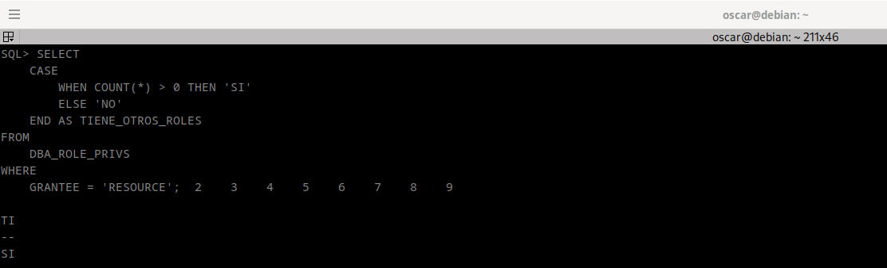

21. Consulta qué perfiles existen en tu base de datos.

```
SELECT RESOURCE_NAME FROM DBA_PROFILES;
```
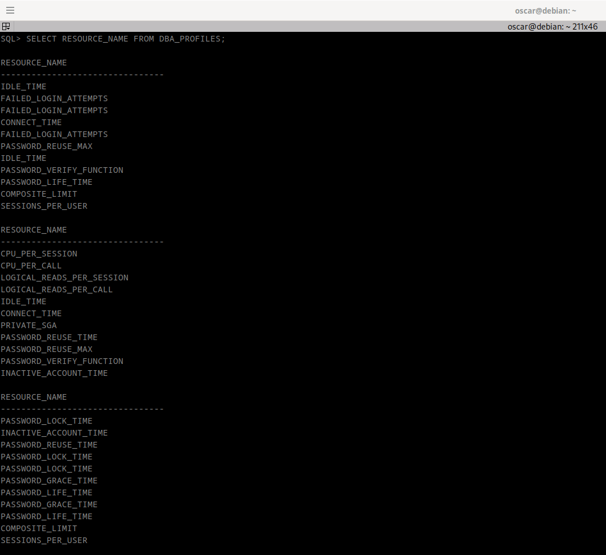

22. Elige un perfil y consulta qué límites se establecen en el mismo.
```
SELECT RESOURCE_NAME, LIMIT FROM DBA_PROFILES WHERE PROFILE = 'CONTRASENASEGURA';
```
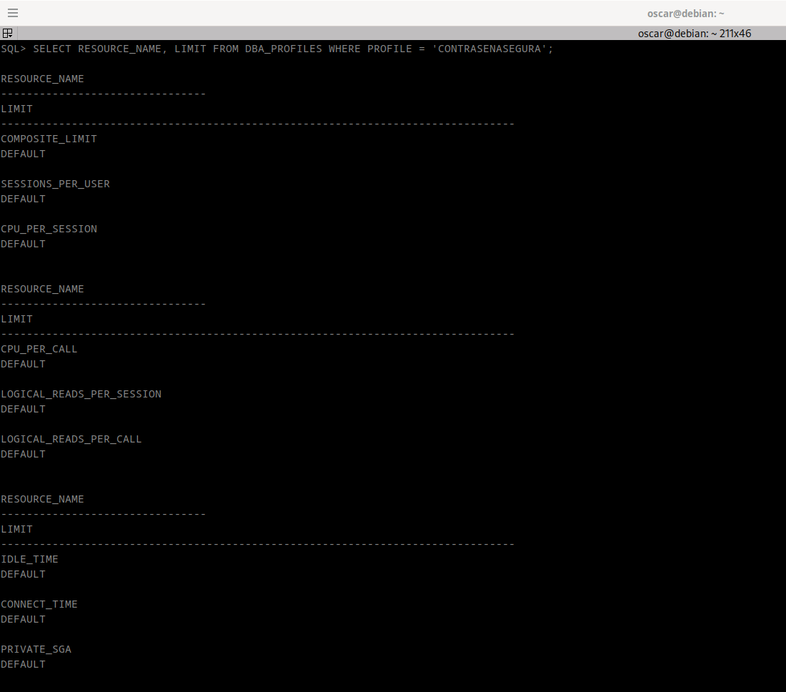
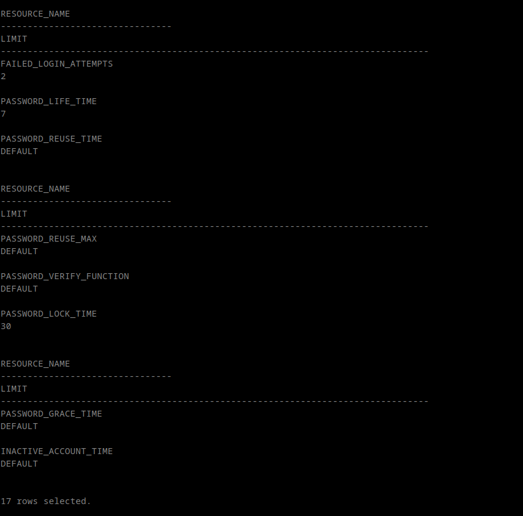


23. Muestra los nombres de los usuarios que tienen limitado el número de sesiones concurrentes y el tiempo máximo de conexión.

```
SELECT profile
FROM DBA_PROFILES
WHERE (resource_name = 'SESSIONS_PER_USER' AND limit NOT IN ('UNLIMITED', 'DEFAULT'))
   OR (resource_name = 'CONNECT_TIME' AND limit NOT IN ('UNLIMITED', 'DEFAULT'));
```

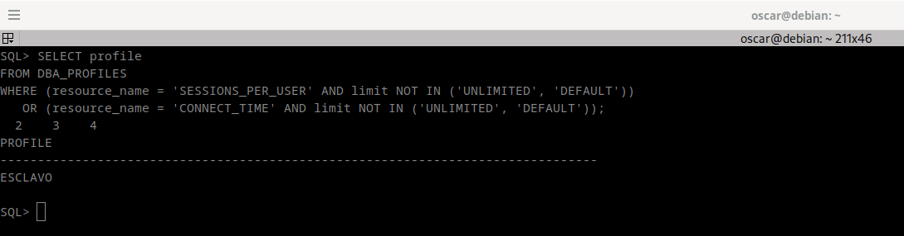

24. Realiza un procedimiento que reciba un nombre de usuario y un privilegio de sistema y nos muestre el mensaje 'SI, DIRECTO' si el usuario tiene ese privilegio concedido directamente, 'SI, POR ROL' si el usuario tiene ese privilegio en alguno de los roles que tiene concedidos y un 'NO' si el usuario no tiene dicho privilegio. Debes realizar el procedimiento empleando la técnica de la recursividad para contemplar infinitos niveles de roles anidados.


25. Reaaliza un procedimiento llamado MostrarTiempoSesión que reciba un nombre de usuario y muestre el tiempo máximo de una sesión y el que ha transcurrido realmente en cada una de las sesiones que tenga abiertas.

```
CREATE OR REPLACE PROCEDURE MostrarTiempoSesion (
    usuario IN VARCHAR2
) IS
    v_perfil         VARCHAR2(30);
    v_maxsesiones    NUMBER;
    v_tiempo_maximo  NUMBER;
    v_tiempo_real    NUMBER;
BEGIN
    BEGIN
        SELECT profile INTO v_perfil
        FROM DBA_USERS
        WHERE username = usuario
        SELECT TO_NUMBER(
                   CASE 
                       WHEN REGEXP_LIKE(limit, '^\d+$') THEN limit
                       ELSE NULL
                   END
               ) INTO v_maxsesiones
        FROM DBA_PROFILES
        WHERE profile = v_perfil
              AND resource_name = 'SESSIONS_PER_USER';

        SELECT TO_NUMBER(
                   CASE 
                       WHEN REGEXP_LIKE(LIMIT, '^\d+$') THEN LIMIT
                       ELSE NULL
                   END
               ) INTO v_tiempo_maximo
        FROM DBA_PROFILES
        WHERE PROFILE = v_perfil
              AND RESOURCE_NAME = 'IDLE_TIME';

        SELECT SUM(LAST_CALL_ET) INTO v_tiempo_real
        FROM V$SESSION

        WHERE username = usuario;
        DBMS_OUTPUT.PUT_LINE('El usuario ' || usuario || ' tiene sesiones concurrentes permitidas de: ' || v_perfil);
        DBMS_OUTPUT.PUT_LINE('Tiempo máximo permitido para la sesión: ' || v_tiempo_maximo || ' segundos');
        DBMS_OUTPUT.PUT_LINE('Tiempo real transcurrido en todas las sesiones: ' || v_tiempo_real || ' segundos');
    END;
END MostrarTiempoSesion;
/
```
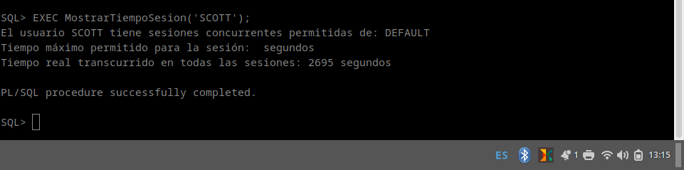
