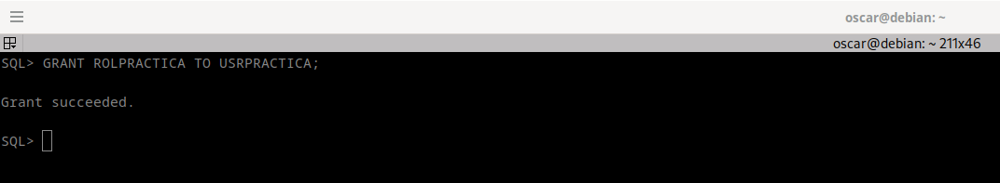

# Alumno 1 (ORACLE):

1.Crea un rol ROLPRACTICA con los privilegios (no roles) necesarios para conectarse a la base de datos, crear tablas y vistas e insertar datos en la tabla EMP de SCOTT.

```
CREATE ROLE ROLPRACTICA;

GRANT CONNECT, CREATE VIEW, CREATE TABLE TO ROLPRACTICA;

GRANT INSERT ON SCOTT.EMP TO ROLPRACTICA;
```


2.Crea un usuario USRPRACTICA con el tablespace USERS por defecto y averigua que cuota se le ha asignado por defecto en cada tablespace. Ponle una cuota de 1M en USERS.


```
CREATE USER USRPRACTICA IDENTIFIED BY "usuario" DEFAULT TABLESPACE USERS;

SELECT USERNAME,BYTES FROM DBA_TS_QUOTAS WHERE USERNAME = 'USRPRACTICA';

sqlplus  USRPRACTICA/usuario

```


```
Cambio la cuota y verificamos.

ALTER USER USRPRACTICA QUOTA 1M ON USERS;

SELECT USERNAME,BYTES FROM DBA_TS_QUOTAS WHERE USERNAME = 'USRPRACTICA';

```


3.Modifica el usuario USRPRACTICA para que tenga cuota 0 en el tablespace SYSTEM.

```
ALTER USER USRPRACTICA QUOTA 0 ON SYSTEM;
```


4.Concede a USRPRACTICA el ROLPRACTICA.

```
GRANT ROLPRACTICA TO USRPRACTICA;
```




5. Concede a USRPRACTICA el privilegio de crear tablas, insertar y modificar datos en el esquema de cualquier otro usuario. Prueba el privilegio. Comprueba si puede modificar la estructura o eliminar las tablas creadas.
6. Concede a USRPRACTICA el privilegio de leer la tabla EMP de SCOTT con la posibilidad de que lo pase a su vez a terceros usuarios.
7. Da a USRPRACTICA los permisos necesarios para poder crear triggers sobre sus tablas.
8. Quita a USRPRACTICA1 el privilegio de crear vistas. Comprueba que ya no puede hacerlo.
9. Crea un perfil ESCLAVO que limita a uno el número de minutos de inactividad permitidos en una sesión y a ocho minutos el tiempo máximo de duración de una sesión.
10. Activa el uso de perfiles en ORACLE. Modifica el perfil ESCLAVO poniendo el parámetro COMPOSITE LIMIT en su valor mínimo. Comprueba cuántas operaciones se pueden realizar.
11. Asigna el perfil creado a USRPRACTICA y comprueba su correcto funcionamiento.
12. Crea un perfil CONTRASEÑASEGURA especificando que la contraseña caduca semanalmente y sólo se permiten dos intentos fallidos para acceder a la cuenta. En caso de superarse, la cuenta debe quedar bloqueada por un mes.
13. Asigna el último perfil creado a USRPRACTICA y comprueba su funcionamiento. Desbloquea posteriormente al usuario.
14. Elige un usuario concreto y consulta qué cuota tiene sobre cada uno de los tablespaces.
15. Consulta qué usuarios existen en tu base de datos con la cuota de algún tablespace gastada en más de un 50%.
16. Elige un usuario concreto y muestra qué privilegios de sistema tiene asignados.
17. Elige un usuario concreto y muestra qué privilegios sobre objetos tiene asignados con la posibilidad de concederlos a otro usuario.
18. Consulta qué roles existen en tu base de datos.
19. Elige un rol concreto y consulta qué usuarios lo tienen asignado.
20. Elige un rol concreto y averigua si está compuesto por otros roles o no. La consulta debe responder SI o NO.
21. Consulta qué perfiles existen en tu base de datos.
22. Elige un perfil y consulta qué límites se establecen en el mismo.
23. Muestra los nombres de los usuarios que tienen limitado el número de sesiones concurrentes y el tiempo máximo de conexión.
24. Realiza un procedimiento que reciba un nombre de usuario y un privilegio de sistema y nos muestre el mensaje 'SI, DIRECTO' si el usuario tiene ese privilegio concedido directamente, 'SI, POR ROL' si el usuario tiene ese privilegio en alguno de los roles que tiene concedidos y un 'NO' si el usuario no tiene dicho privilegio. Debes realizar el procedimiento empleando la técnica de la recursividad para contemplar infinitos niveles de roles anidados.
25. Realiza un procedimiento llamado MostrarTiempoSesión que reciba un nombre de usuario y muestre el tiempo máximo de una sesión y el que ha transcurrido realmente en cada una de las sesiones que tenga abiertas.
