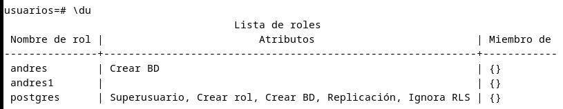
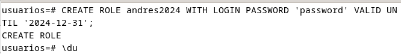
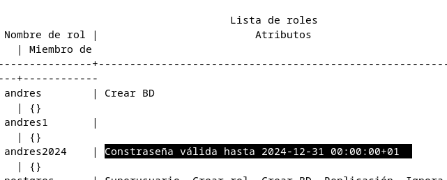
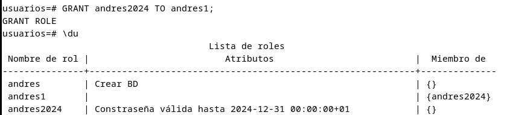
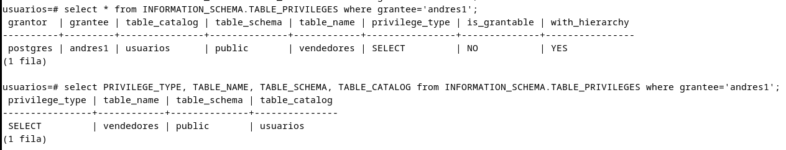
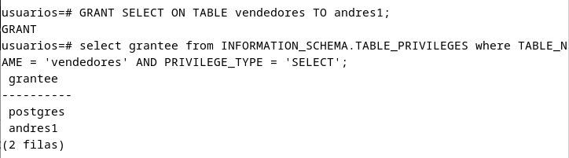
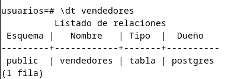
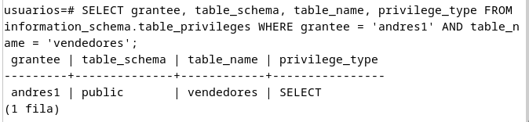

# Alumno 2 (Postgres y ORACLE):

## Postgres:

## 1. Averigua que privilegios de sistema hay en Postgres y como se asignan a un usuario.

La verdad que PostgreSQL funciona un poco diferente a Oracle, ya que los  privilegios y permisos se administran utilizando roles. Estos roles son básicamente grupos de usuarios que comparten los mismos privilegios y permisos en la base de datos, algo parecido a los "privilegios de los grupos" como tal, pero haciendo incapié que evidente no es lo mismo, pero sirve un poco para poder comprenderlo de mejor manera.

| Privilegio   | Descripción                                               |
|--------------|-----------------------------------------------------------|
| SELECT       | Permite al usuario recuperar datos de una tabla o vista.   |
| INSERT       | Permite al usuario agregar nuevos registros a una tabla.   |
| UPDATE       | Permite al usuario modificar los registros existentes.     |
| DELETE       | Permite al usuario eliminar registros de una tabla.        |
| TRUNCATE     | Permite al usuario truncar una tabla, es decir, eliminar todos los registros. |
| REFERENCES   | Permite al usuario crear una clave foránea que haga referencia a otra tabla. |
| TRIGGER      | Permite al usuario crear y ejecutar disparadores (triggers).|
| CREATE       | Permite al usuario crear nuevos objetos en la base de datos, como tablas, vistas, índices, etc. |
| CONNECT      | Permite al usuario conectarse a una base de datos específica. |
| TEMPORARY    | Permite al usuario crear tablas temporales.                 |
| EXECUTE      | Permite al usuario ejecutar una función.                    |
| USAGE        | Permite al usuario utilizar un esquema, secuencia o función. |


### Roles:

Los roles se asignan por ejemplo tanto a usuarios como también a grupos de usuarios, aunque también pueden ser asignados a otros roles, permitiendo la creación de jerarquías y estructuras más complejas. La asignación de roles puede realizarse en diferentes niveles, como bases de datos, esquemas y tablas. Por ejemplo, como vimos en clase si tenemos varios roles A B y C, C puede contener también sus privilegios y también los de A o B.

### Roles a Objetos de Bases de Datos:

Además de asignar roles a usuarios, se pueden asignar a objetos específicos de la base de datos, como vistas, secuencias y funciones. También es posible asignar roles a otros objetos de la base de datos, como índices y secuencias.

Por ejemplo la asignación de permisos a un rol puede llevarse a cabo de dos maneras, durante la creación del rol mediante la instrucción CREATE ROLE rol WITH opción y por otra parte después de la creación del rol mediante la instrucción ALTER ROLE rol WITH opción.

### Opciones de Roles:

Algunas de las opciones de uso para los roles son:

- SUPERUSER/NOSUPERUSER: Para otorgar privilegios de super usuario.
- ADMIN: Establece qué rol o roles tienen el derecho de agregar otros roles.
- CREATEDB/NOCREATEDB: Para permitir o no que un usuario pueda crear nuevas bases de datos
- REPLICATION/NOREPLICATION: Permite o niega al usuario replicar la base de datos.
- CREATEROLE/NOCREATEROLE: Para permitir o no que un usuario pueda crear nuevos roles.
- INHERIT/NOINHERIT: Para que un usuario herede  privilegios de los roles o no.
- LOGIN/NOLOGIN: Para conceder o no que un usuario pueda iniciar sesión.
- CONNECTION LIMIT: Para establecer un límite de las conexiones simultáneas.
- VALID UNTIL: Para establecer una fecha de caducidad de un usuario.
- PASSWORD: Para asignar contraseñas.
- ENCRYPTED: Para establecer si la contraseña debe estar encriptada (si fuera necesario).
- IN ROLE: Define los roles a los que pertenece el usuario.

Ejemplo:

Para crear un rol que de privilegios que permita crear bases de datos o crear neuvos roles:

`CREATE ROLE rol WITH CREATEDB, CREATEROLE;`

Para asignarme el nuevo rol:

`ALTER USER andres WITH ROLE rol;`


## 2. Averigua cual es la forma de asignar y revocar privilegios sobre una tabla concreta en Postgres.

PAra asignar y revocar permisos en postgre, están los parámetros como Grant y por ejemplo insert, update, o delete para asignarle permisos a un usuario sobre una tabla, y por otro lado esta revoke, precisamete para retirar los privilegios he otorgado. TAmbién está WITH GRAN OPTION que digamos que sirve para que el usuario al que le estoy dando privilegios, pueda tambien otorgar privilegios a otros. Por ejemplo:

```sql
GRANT tipo_permiso 
  ON tabla 
  TO usuario_o_rol
```


```sql
GRANT SELECT ON tabla1 TO andres;
```

```sql
GRANT SELECT ON tabla1 TO andres WITH GRANT OPTION;
```


Por ejemplo en una tabla llamada vendedores, mi usuario andres no tenia privilegios select ni insert, y al no tenerlos da un fallo impidiendo la operación, y para solucionarlo le he dado privilegios con GRANT para que pueda hacer select e insert. (Es un ejemplo simple, pero es util para ver el funcionamiento)

```sql
usuarios=# CREATE TABLE vendedores (
    id INT PRIMARY KEY,
    nombre VARCHAR(50),
    apellido VARCHAR(50),
    edad INT,
    ciudad VARCHAR(100)
);
CREATE TABLE
usuarios=# INSERT INTO vendedores (id, nombre, apellido, edad, ciudad) VALUES
    (1, 'Ana', 'Solano', 28, 'Sevilla'),
    (2, 'Jaime', 'García', 32, 'Sevilla'),
    (3, 'Carmen', 'Santaella', 30, 'Sevilla'),
    (4, 'David', 'Rodríguez', 29, 'Sevilla'),
    (5, 'Jose', 'Fernández', 27, 'Sevilla');
INSERT 0 5
usuarios=# 
usuarios=# 
usuarios=# select * from vendedores;
 id | nombre | apellido  | edad | ciudad  
----+--------+-----------+------+---------
  1 | Ana    | Solano    |   28 | Sevilla
  2 | Jaime  | García    |   32 | Sevilla
  3 | Carmen | Santaella |   30 | Sevilla
  4 | David  | Rodríguez |   29 | Sevilla
  5 | Jose   | Fernández |   27 | Sevilla
(5 filas)

usuarios=# REVOKE SELECT, INSERT ON TABLE vendedores FROM andres;
REVOKE
usuarios=# \c usuarios andres;
Contraseña para usuario andres: 
Conexión SSL (protocolo: TLSv1.3, cifrado: TLS_AES_256_GCM_SHA384, compresión: desactivado)
Ahora está conectado a la base de datos «usuarios» con el usuario «andres».
usuarios=> select * from vendedores;
ERROR:  permiso denegado a la tabla vendedores

usuarios=> \c usuarios postgres;
Contraseña para usuario postgres: 
Conexión SSL (protocolo: TLSv1.3, cifrado: TLS_AES_256_GCM_SHA384, compresión: desactivado)
Ahora está conectado a la base de datos «usuarios» con el usuario «postgres».
usuarios=# GRANT SELECT, INSERT ON TABLE vendedores to andres;
GRANT

usuarios=# \c usuarios andres;
Contraseña para usuario andres: 
Conexión SSL (protocolo: TLSv1.3, cifrado: TLS_AES_256_GCM_SHA384, compresión: desactivado)
Ahora está conectado a la base de datos «usuarios» con el usuario «andres».
usuarios=> select * from vendedores;
 id | nombre | apellido  | edad | ciudad  
----+--------+-----------+------+---------
  1 | Ana    | Solano    |   28 | Sevilla
  2 | Jaime  | García    |   32 | Sevilla
  3 | Carmen | Santaella |   30 | Sevilla
  4 | David  | Rodríguez |   29 | Sevilla
  5 | Jose   | Fernández |   27 | Sevilla
(5 filas)

usuarios=> INSERT INTO vendedores (id, nombre, apellido, edad, ciudad) VALUES (6, 'Pepe', 'Florencia', 27, 'Sevilla');
INSERT 0 1
usuarios=> select * from vendedores;
 id | nombre | apellido  | edad | ciudad  
----+--------+-----------+------+---------
  1 | Ana    | Solano    |   28 | Sevilla
  2 | Jaime  | García    |   32 | Sevilla
  3 | Carmen | Santaella |   30 | Sevilla
  4 | David  | Rodríguez |   29 | Sevilla
  5 | Jose   | Fernández |   27 | Sevilla
  6 | Pepe   | Florencia |   27 | Sevilla
(6 filas)
```

En resumen, se usa GRANT para otorgar, REVOKE para quitar los privilegios y WITH GRANT OPTION para otorgar que otro pueda dar también privilegios.


## 3. Averigua si existe el concepto de rol en Postgres y señala las diferencias con los roles de ORACLE.

Sí, es más, los usuarios como tal realmente son roles. Aunque a la hora de crear un usuario se usa user, realmente se crean como roles, por eso en vez de otorgar roles a un usuario, lo que se hace es otorgar privilegios a un rol usado como usuario. En cambio en Oracle es distinto, ya que un usuario y un rol tienen significados diferentes a diferencia de Postgre. En Oracle, estos pueden ser grupos de usuarios o roles incluso. Los roles son mal dicho usuarios que también son propietarios de las bb en Postgre, y pueden tener otros roles dentro de roles también. 

Para crear un rol en Postgre:

```sql
CREATE ROLE nombrerol;
GRANT privilegios ON objeto/tabla TO usuario/rol;

CREATE ROLE andres2;
GRANT SELECT, INSERT ON tabla TO andres2;
```

En cambio en Oracle:

```sql

GRANT rol TO usuario

```

Para los roles y sus privilegios en Oracle, se consulta el diccionario de datos con las vistas `DBA_ROLES, DBA_ROLE_PRIVS y ROLE_ROLE_PRIVS`. En cuanto a Postgres es con la orden `\du`




## 4. Averigua si existe el concepto de perfil como conjunto de límites sobre el uso de recursos o sobre la contraseña en Postgres y señala las diferencias con los perfiles de ORACLE. En cualquier caso, intenta averiguar la forma de implementar en Postgres cada uno de los límites que se pueden definir en ORACLE.

Postgre no tiene un concepto de "perfiles" como en Oracle, donde los perfiles son conjuntos de límites sobre el uso de recursos y la configuración de contraseñas para los usuarios. En Postgre, la gestión de recursos y permisos se realiza a través de roles y asignación de privilegios.

Postgre tiene opciones de gestionar los recursos y las configuraciones de usuarios (roles) a través de roles para gestionar permisos, aunque también permite establecer configuraciones como el uso de la memoria y la cantidad de conexiones simultáneas, aunque estos límites se aplican a todo y no a un único usuario. Supuestamente Postgre tiene una versión profesional que abarca todo esto, pero no estoy seguro de ello y por lo que he podido ver no dan mucha información sin tener que obtenerlo.

Por otro lado para los límites en Postgre he encontrado `pgbouncer` que sirve para administrar las conexiones al servidor con agrupaciones para sesiones o transacciones pudiendo limitar el uso. Para más info dejo esta página https://www.pgbouncer.org/usage.html

Otra forma más sencilla es directamente en su archivo de configuración, aunque comparado con Oracle, tiene muchisimas menos opciones de gestión avanzada en este sentido. Por ejemplo:

```
max_connections: número máximo de conexiones simultáneas

shared_buffers: cantidad de memoria que Postgre utiliza para almacenar datos en caché

work_mem: cantidad de memoria asignada para cada operación. consultas, etc

maintenance_work_mem: cantidad de memoria asignada para operaciones de mantenimiento
```


## 5. Crea un rol valido hasta final de 2024 en Postgres y añádelo a otro rol existente.

Para este ejercicio he decidido crear un rol llamado `andres2024` donde establezco la caducidad de la contraseña para finales de 2024, y lo he añadido al usuario andres1.








## 6. Realiza consultas al diccionario de datos de Postgres para averiguar todos los privilegios que tiene un usuario concreto.

PAra averiguar los privilegios de un usuario, por ejemplo en mi caso andres1, hay que hacer una consulta:

```sql

select * from INFORMATION_SCHEMA.TABLE_PRIVILEGES where grantee='andres1';
```

Aunque para una consulta mas específica:

```sql
SELECT PRIVILEGE_TYPE, TABLE_NAME, TABLE_SCHEMA, TABLE_CATALOG FROM INFORMATION_SCHEMA.TABLE_PRIVILEGES WHERE GRANTEE='andres1';
```




## 7. Realiza consultas al diccionario de datos en Postgres para averiguar qué usuarios pueden consultar una tabla concreta.

Para hacer este ejercicio hay que hacer una consulta a INFORMATION_SCHEMA.TABLE_PRIVILEGES. En mi ejemplo tengo una tabla llamada vendedores a la cual le he dado privilegios al usuario andres1. Al hacer la consulta aparece andres1 y postgres que significa que esos son los usuarios que pueden consultar la tabla vendedores.




## 8. Realiza una consulta al diccionario de datos de Postgres para mostrar qué usuarios tienen privilegios sobre algún objeto de otro usuario.

Para comprobar esto con la tabla vendedores que pertenece al usuario postgres (para ver el propietario de una tabla es con `\dt nombretabla`), se ve como andres1 tambien tiene privilegios en ese objeto que no le pertenece, sino a postgres:






## ORACLE:

## 1. Realiza una función de verificación de contraseñas que compruebe que la contraseña tiene el mismo formato que una dirección IPv4 y que la longitud de la misma es diferente de la longitud de la anterior. Asígnala al perfil CONTRASEÑARARA. Comprueba que funciona correctamente.

## 2. Realiza un procedimiento llamado MostrarPrivilegiosdelRol que reciba el nombre de un rol y muestre los privilegios de sistema y los privilegios sobre objetos que lo componen, incluyendo los pertenecientes a otros roles concedidos a dicho rol. Debes utilizar la técnica de la recursividad contemplando la posibilidad de que existan infinitos niveles de roles anidados.
Asígnala al perfil CONTRASEÑARARA. Comprueba que funciona correctamente.

Realiza un procedimiento llamado MostrarPrivilegiosdelRol que reciba el nombre de un rol y muestre los privilegios de sistema y los privilegios sobre objetos que lo componen, incluyendo los pertenecientes a otros roles concedidos a dicho rol. Debes utilizar la técnica de la recursividad contemplando la posibilidad de que existan infinitos niveles de roles anidados.
