# CASO PRÁCTICO 1:

1. (ORACLE, Postgres, MySQL) Crea un usuario llamado Empleado y, sin usar los roles de ORACLE, dale los siguientes privilegios: (1,5 puntos)

Conectarse a la base de datos.

Modificar la duración máxima de las sesiones de otros usuarios.

Modificar índices en cualquier esquema (este privilegio podrá pasarlo a quien quiera)

Insertar filas en scott.emp (este privilegio podrá pasarlo a quien quiera)

Insertar datos en tablas ubicadas en cualquier tablespace.

Gestión completa de usuarios, privilegios y roles.

# ORACLE


1.1 Conectarse a la base de datos.

```
CREATE USER Empleado IDENTIFIED BY 1234;
```
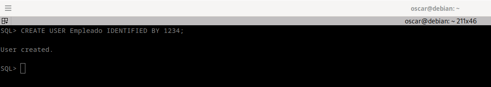


2.2 Modificar la duración máxima de las sesiones de otros usuarios.

```
GRANT CREATE SESSION TO Empleado;
```
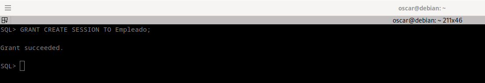

3.3 Modificar índices en cualquier esquema (este privilegio podrá pasarlo a quien quiera)

```
GRANT GRANT ANY OBJECT PRIVILEGE TO Empleado WITH ADMIN OPTION;
GRANT ALTER ANY INDEX TO Empleado;
```
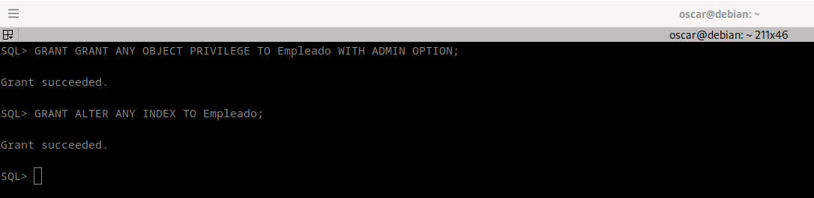

4.4 Insertar filas en scott.emp (este privilegio podrá pasarlo a quien quiera)

```
GRANT INSERT ON scott.emp TO Empleado WITH GRANT OPTION;
```
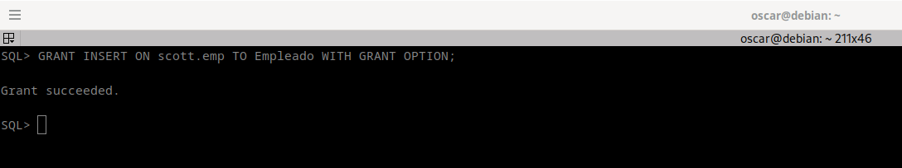


5.5 Insertar datos en tablas ubicadas en cualquier tablespace.

```
GRANT UNLIMITED TABLESPACE TO Empleado;
```
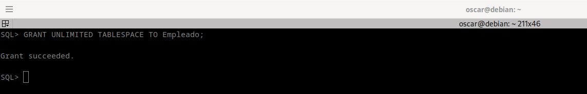


6.6 Gestión completa de usuarios, privilegios y roles.

```
Gestión de usuarios:
 
GRANT CREATE USER TO Empleado;
GRANT BECOME USER TO Empleado;
GRANT ALTER USER TO Empleado;
GRANT DROP USER TO Empleado;

Gestión de privilegios: 

GRANT ALL PRIVILEGES TO Empleado;

Gestión de roles:

 
GRANT CREATE ROLE TO Empleado;
GRANT ALTER ANY ROLE TO Empleado;
GRANT DROP ANY ROLE TO Empleado;
GRANT GRANT ANY ROLE TO Empleado;

```
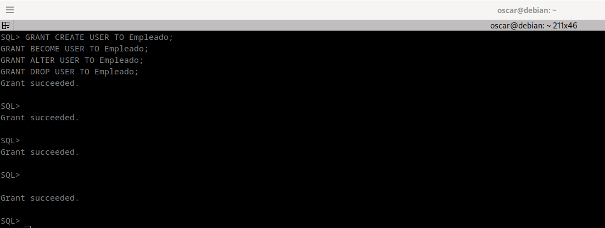
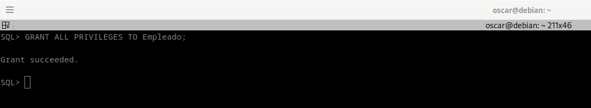
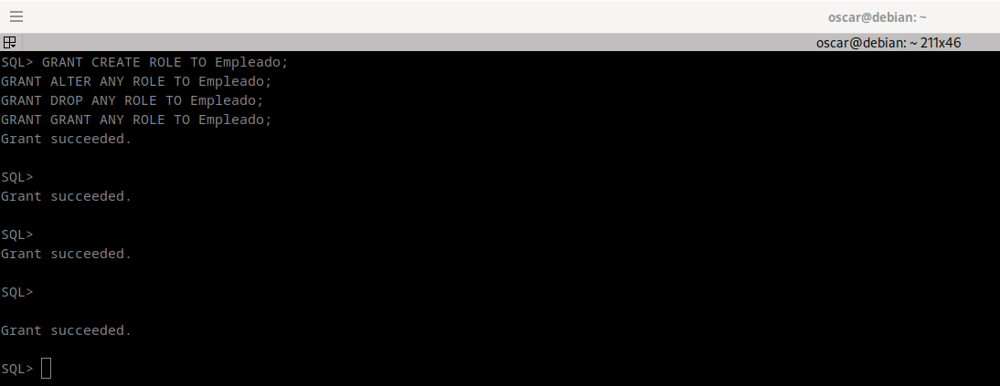


# MYSQL

1.1 Conectarse a la base de datos.

```
CREATE USER 'Empleado'@'localhost' IDENTIFIED BY '1234';
```
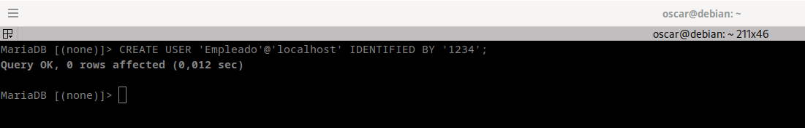
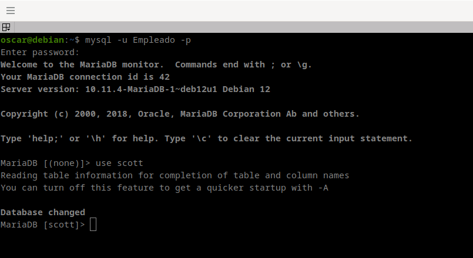


2.2 Modificar la duración máxima de las sesiones de otros usuarios.

Para modificar la sesion maxima de un usuario  sobre una sesion para los usuarios, debemos ir a la siguiente ruta /etc/mysql/mariadb.conf.d/50-mysqld_safe.cnf y modificar el siguiente valor por el que consideramos.

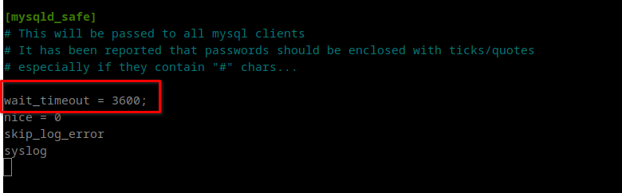

3.3 Modificar índices en cualquier esquema (este privilegio podrá pasarlo a quien quiera)


```
GRANT ALTER, INDEX ON *.* TO 'Empleado'@'localhost';

```
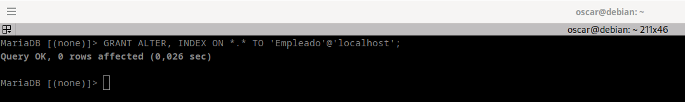


Crear índice

```
create index indice on EMP(ename);
```

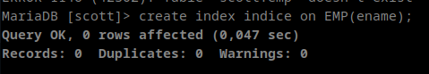


```
show indexes from EMP;
```
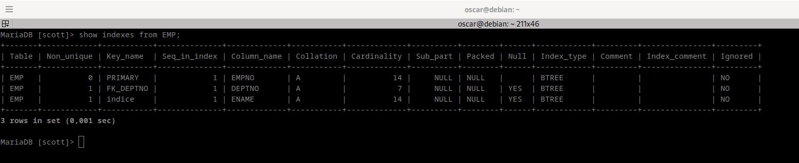


4.4 Insertar filas en scott.emp (este privilegio podrá pasarlo a quien quiera)

```
GRANT INSERT ON scott.Emp TO 'Empleado'@'localhost' WITH GRANT OPTION;
```

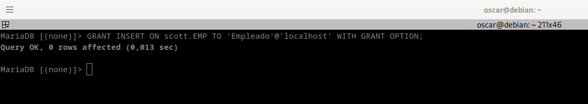

```
INSERT INTO SCOTT.DEPT VALUES (80, 'INFORMATICA', 'ESPANA');

INSERT INTO EMP VALUES (7512, 'OSCAR', 'SAN', 7902, '1980-12-17', 300, NULL, 20);
```

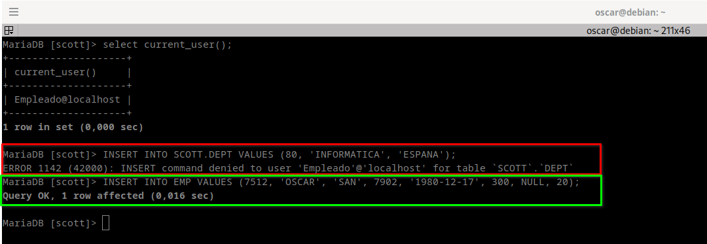

5.5 Gestión completa de usuarios, privilegios y roles.

```
GRANT ALL PRIVILEGES ON *.* TO 'Empleado'@'localhost' WITH GRANT OPTION;
```

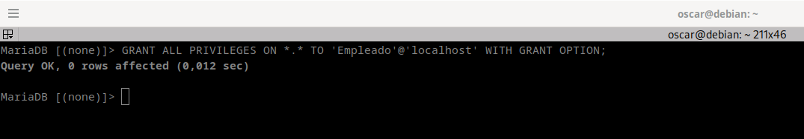

6.6 Insertar datos en tablas ubicadas en cualquier tablespace.


2. (ORACLE, Postgres, MySQL) Escribe una consulta que obtenga un script para quitar cualquier privilegio de consulta a alguna tabla de SCOTT a los usuarios que lo tengan.

# ORACLE
```
SELECT 'REVOKE SELECT ON SCOTT.' || table_name || ' FROM ' || grantee || ';' AS revoke_statement
FROM DBA_TAB_PRIVS
WHERE OWNER = 'SCOTT'
  AND PRIVILEGE = 'SELECT';
```

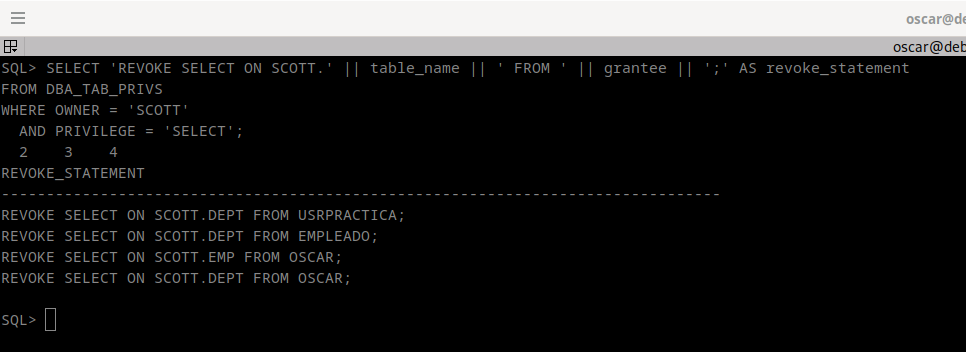

```
grant Select on SCOTT.EMP to oscar;
grant Select on SCOTT.DEPT to oscar;
```

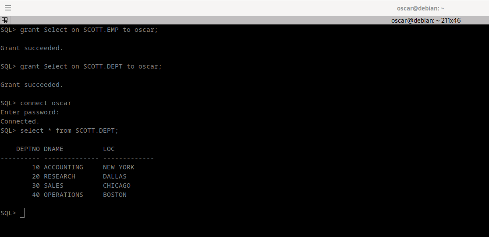


# MYSQL

```
GRANT SELECT ON scott.EMP to 'Empleado'@'localhost' IDENTIFIED BY "1234" WITH GRANT OPTION;

select concat('Revoke Select on ',table_schema,'.',table_name,' from ',grantee,';') as script
from information_schema.table_privileges
where table_schema='scott'
and privilege_type='SELECT';
```

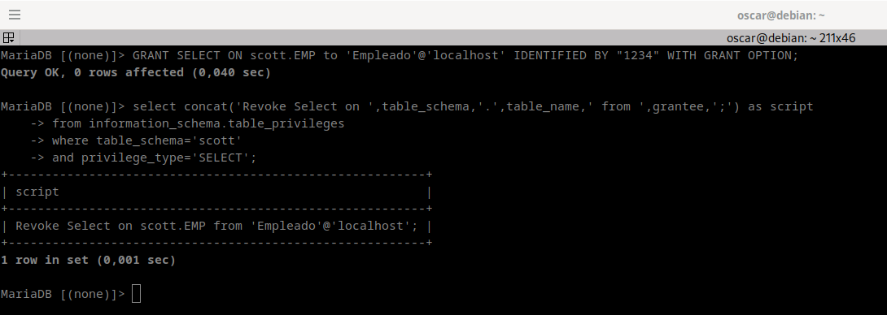


3. (ORACLE) Crea un tablespace TS2 con tamaño de extensión de 256K. Realiza una consulta que genere un script que asigne ese tablespace como tablespace por defecto a los usuarios que no tienen privilegios para consultar ninguna tabla de SCOTT, excepto a SYSTEM.

```
create tablespace TS2 
  datafile 'tbs_ts2.dbf' 
  size 256k;

```
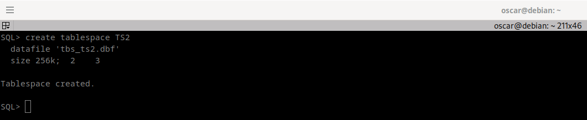

```
select 'alter user "'||username||'" default tablespace TS2;'
  from DBA_USERS
  where USERNAME!='SYSTEM'
  and USERNAME not in (select GRANTEE 
                         from DBA_TAB_PRIVS 
                         where PRIVILEGE='SELECT' 
                         and OWNER='SCOTT');
```

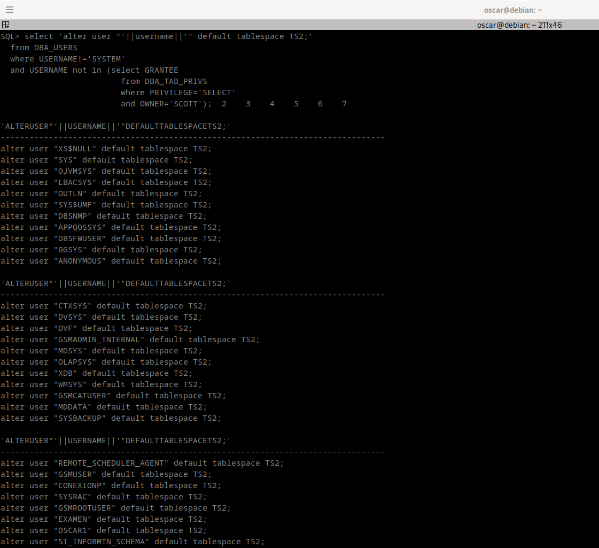


4. (ORACLE, Postgres) Realiza un procedimiento que reciba un nombre de usuario y nos muestre cuántas sesiones tiene abiertas en este momento. Además, para cada una de dichas sesiones nos mostrará la hora de comienzo y el nombre de la máquina, sistema operativo y programa desde el que fue abierta.

# ORACLE

```
CREATE OR REPLACE PROCEDURE MostrarSesiones(p_username VARCHAR2)
AS
  v_num_sesiones NUMBER := 0;
BEGIN
  FOR session_info IN (SELECT
                         TO_CHAR(logon_time, 'YYYY-MM-DD HH24:MI:SS') AS hora_inicio,
                         machine AS nombre_maquina,
                         osuser AS sistema_operativo,
                         program
                       FROM v$session
                       WHERE username = p_username)
  LOOP
    v_num_sesiones := v_num_sesiones + 1;

    DBMS_OUTPUT.PUT_LINE('Número de Sesiones: ' || v_num_sesiones);
    DBMS_OUTPUT.PUT_LINE('Hora de Inicio: ' || session_info.hora_inicio);
    DBMS_OUTPUT.PUT_LINE('Nombre de la Máquina: ' || session_info.nombre_maquina);
    DBMS_OUTPUT.PUT_LINE('Sistema Operativo: ' || session_info.sistema_operativo);
    DBMS_OUTPUT.PUT_LINE('Programa: ' || session_info.program);
  END LOOP;

  DBMS_OUTPUT.PUT_LINE('------------------------------------');
  DBMS_OUTPUT.PUT_LINE('Total de Sesiones: ' || v_num_sesiones);
END;
/


EXEC MostrarSesiones('SCOTT');
```
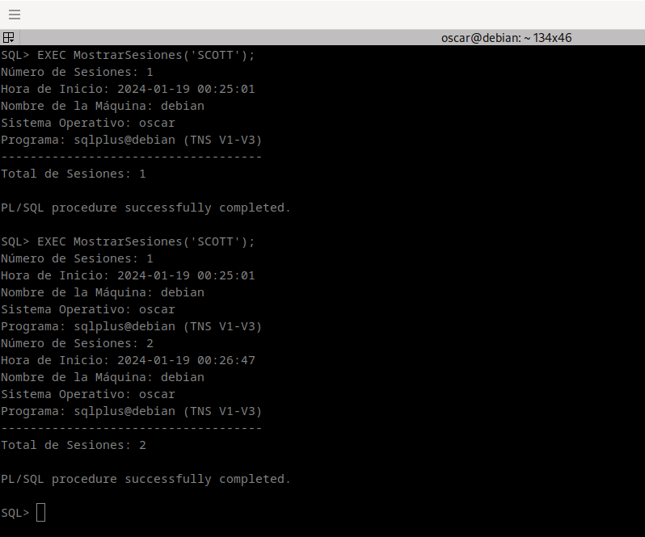


5. (ORACLE) Realiza un procedimiento que muestre los usuarios que pueden conceder privilegios de sistema a otros usuarios y cuales son dichos privilegios.

```
CREATE OR REPLACE PROCEDURE mostrar_sistemap
AS
  CURSOR c_otros IS
    SELECT USERNAME, PRIVILEGE
    FROM USER_SYS_PRIVS
    WHERE PRIVILEGE IN ('CREATE USER', 'ALTER USER', 'DROP USER');
  
  v_u VARCHAR2(30);
  v_p VARCHAR2(30);
BEGIN
  DBMS_OUTPUT.PUT_LINE('-----------------------------------------------------------------');
  DBMS_OUTPUT.PUT_LINE('Otros privilegios de sistema y sus privilegios:');
  DBMS_OUTPUT.PUT_LINE('-----------------------------------------------------------------');
  
  FOR i IN c_otros LOOP
    v_u := i.USERNAME;
    v_p := i.PRIVILEGE;
    DBMS_OUTPUT.PUT_LINE(v_u || ' tiene el privilegio de ' || v_p);
    DBMS_OUTPUT.PUT_LINE('-----------------------------------------------------------------');
  END LOOP;
END mostrar_sistemap;
/

exec mostrar_sistemap;

```

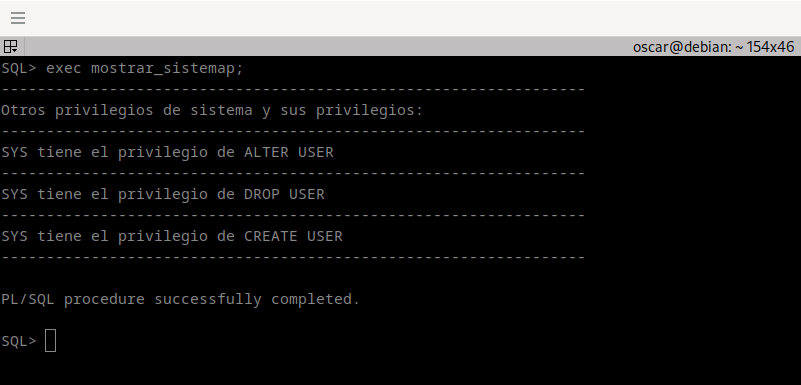
